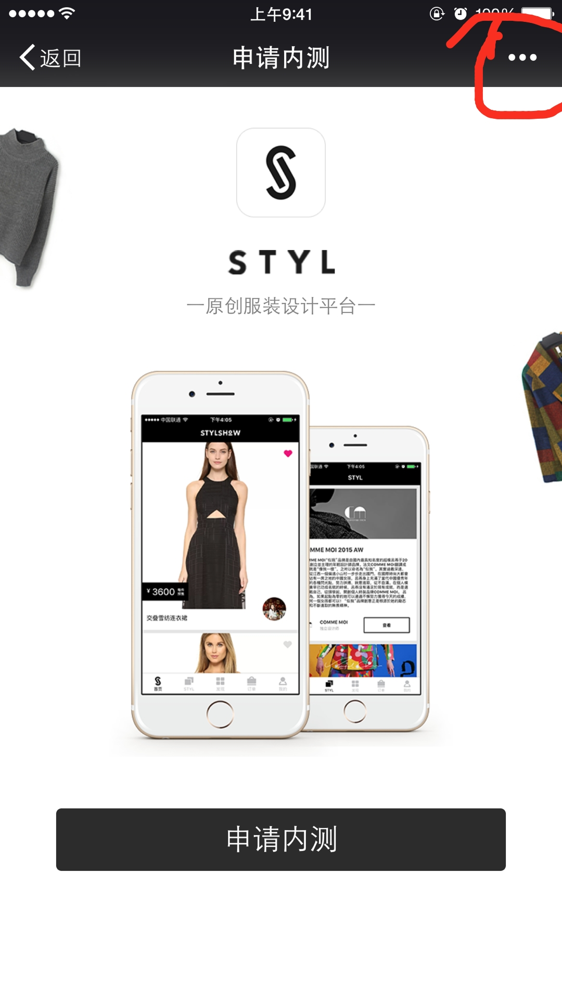
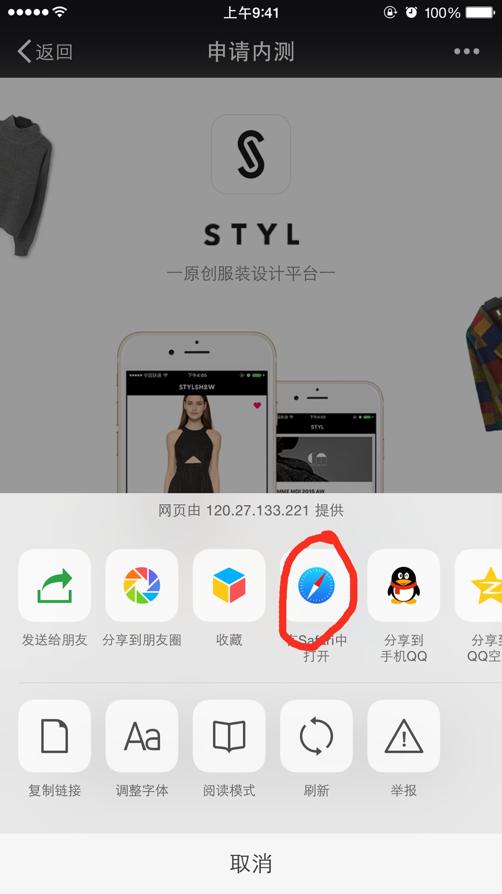
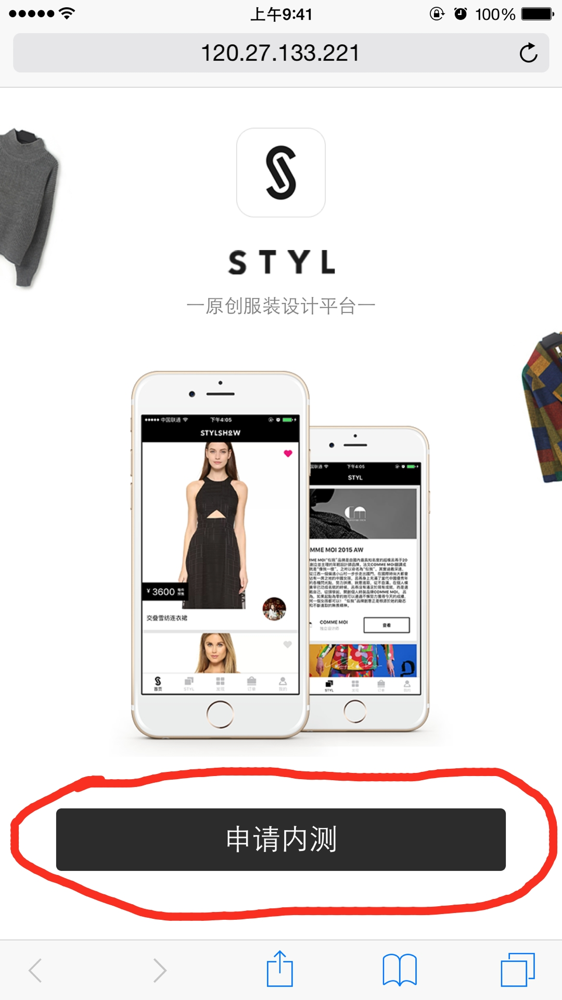
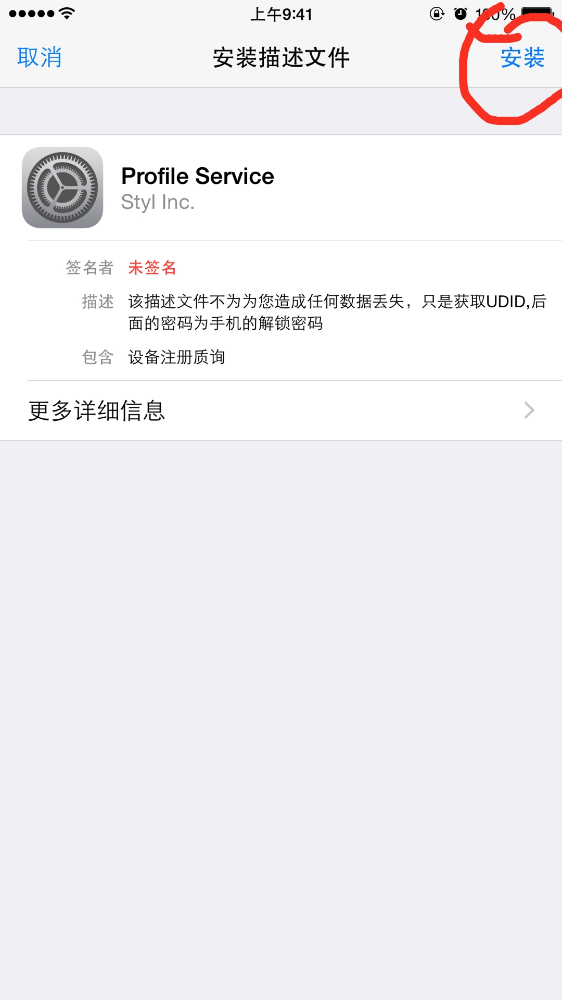
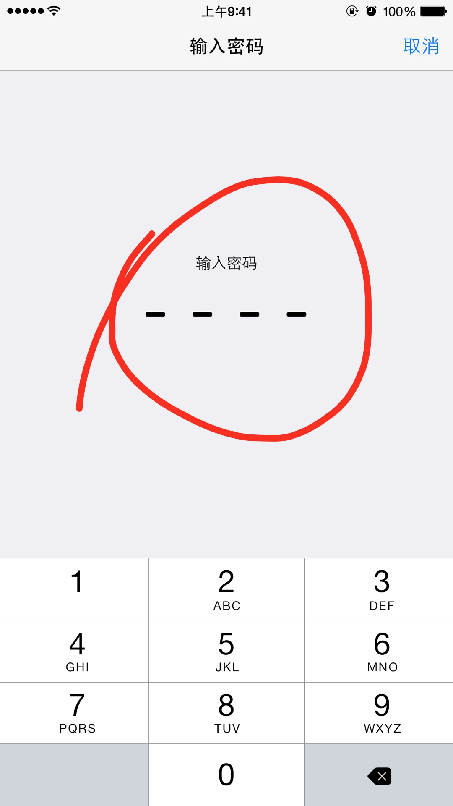
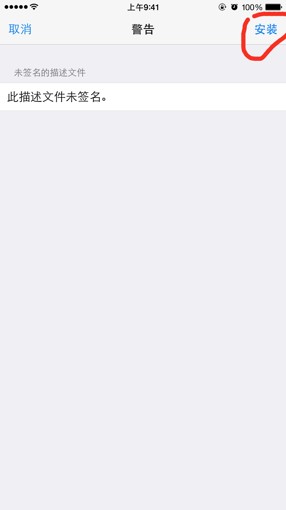
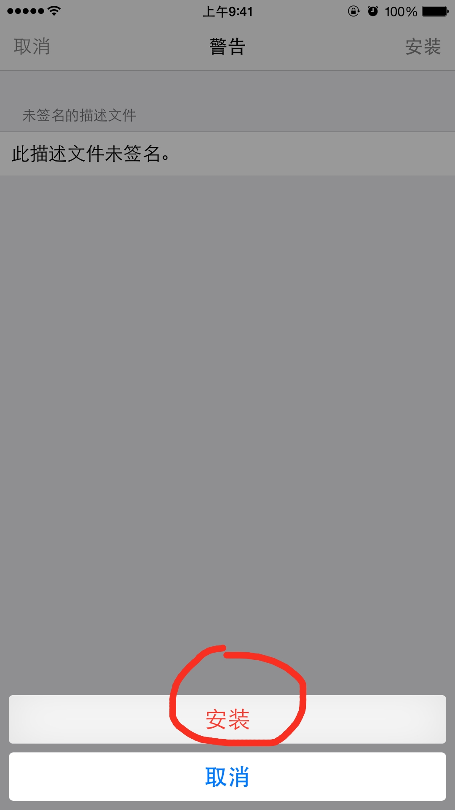
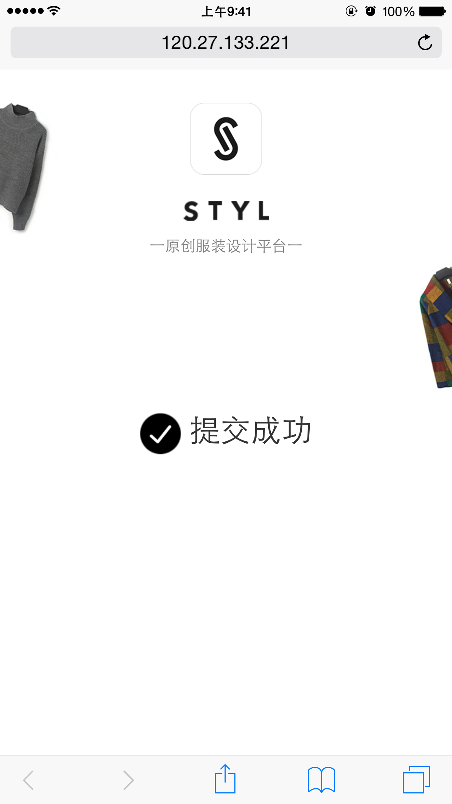

#STYL内测UUID提交说明
##1.从Safari打开文件
###1)在微信或QQ点击右上角的...按钮

###2)选择在Safari中打开

##2.提交UDID
###1)点击申请内测

###2)点击右上角安装
#####安装描述文件并不会在您的手机上留下任何东西.仅仅获取一次UUID，就会自己删除，UUID我们用来发布内测包，这样您的手机才可以安装

###3)输入您的手机解锁密码
#####这个密码是任何人都获取不到的

###4)点击右上角安装

###5)点击红色的安装按钮

###6)提交完成
######我们会在所有人都提交完成之后发布一个版本，供大家试用，以后会根据大家的反馈意见，定期发布一个修改版本

#